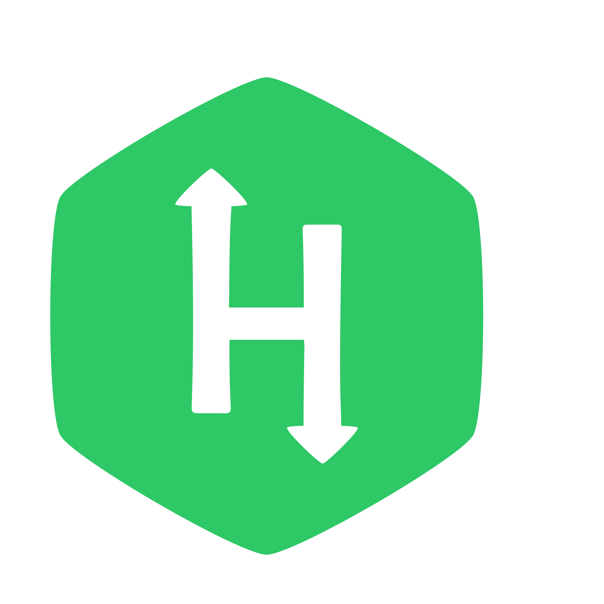

# I'm [Ahmed Harbi](http://www.linkedin.com/in/aharbii) 👋

  
  
  

 

- 👨‍🎓 I'm a Software Engineer with B.Sc. in Communication and Electronics Engineering.
I love physics, mathematics and programming.
- 👨‍💻 I am totally interested in artificial intelligence, computer vision, image processing, digital signal processing, embedded systems, automotive industry, autonomous robotics, and self-driving cars.
- 🚀 I actively learning new technologies, solving challenges and discovering algorithms.
- 🌱 Nowadays I am learning embedded system concepts, drivers and firmware development, real-time operating systems and their dependecies.
- 📚 Skilled in linear algebra, calculus, algorithms and data structures, and digital logic. I am always reading about these topics.

## Languages and Tools

                    

